<div align = center>

# LCDBigNumbers
Arduino library to write big numbers on a 1602 or 2004 LCD.

[](https://www.gnu.org/licenses/gpl-3.0)
 &nbsp; &nbsp; 
[](https://github.com/ArminJo/LCDBigNumbers/releases/latest)
 &nbsp; &nbsp; 
[](https://github.com/ArminJo/LCDBigNumbers/commits/master)
 &nbsp; &nbsp; 
[](https://github.com/ArminJo/LCDBigNumbers/actions)
 &nbsp; &nbsp; 

<br/>
<br/>
[](https://stand-with-ukraine.pp.ua)

Available as [Arduino library "LCDBigNumbers"](https://www.arduinolibraries.info/libraries/lcd-big-numbers).

</div>

#### If you find this library useful, please give it a star.

&#x1F30E; [Google Translate](https://translate.google.com/translate?sl=en&u=https://github.com/ArminJo/LCDBigNumbers)

<br/>

# Features
- **10 different fonts available. From 1x2 up to 3x4.**.
- Support for special big characters `-`, `.` and `:`.
- Fonts which require no gap between numbers (1x2 and 3x2, variant 2 and 3) are printed by default without this gap.
- Support for **parallel and serial** LCD connections.
- For all architectures.

<br/>

# Usage

```c++
// Choose your display
//#define USE_PARALLEL_2004_LCD // Is default
//#define USE_PARALLEL_1602_LCD
//#define USE_SERIAL_2004_LCD
//#define USE_SERIAL_1602_LCD
#include "LCDBigNumbers.hpp" // Include sources for LCD big number generation

LiquidCrystal myLCD(2, 3, 4, 5, 6, 7); // Depends on your actual connections
LCDBigNumbers bigNumberLCD(&myLCD, BIG_NUMBERS_FONT_3_COLUMN_4_ROWS_VARIANT_1); // Use 3x4 numbers, 1. variant

void setup() {
    myLCD.begin(LCD_COLUMNS, LCD_ROWS); // LCD_COLUMNS and LCD_ROWS are set by LCDBigNumbers.hpp depending on the defined display
    bigNumberLCD.begin(); // Creates custom character used for generating big numbers
    
    bigNumberLCD.setBigNumberCursor(0);
    bigNumberLCD.print(-47.11, 2); // use the standard print function
    delay(2000);
    bigNumberLCD.setBigNumberCursor(0, 0); // row specification is redundant here for a 4 row font :-)
    bigNumberLCD.print(F(ONE_COLUMN_HYPHEN_STRING ONE_COLUMN_SPACE_STRING "47.11:")); // print a number string
}
```
A **space character** is always rendered as an empty space with the size and the gap of a number. To have an one column space with the height of a number, you must use `ONE_COLUMN_SPACE_STRING` like above or `ONE_COLUMN_SPACE_CHARACTER` like in `bigNumberLCD.print(ONE_COLUMN_SPACE_CHARACTER)`.<br/>
The `ONE_COLUMN_SPACE_CHARACTER` it is by default a bar `|`.

A **hyphen / minus character** is always rendered with the gap of a number. To have an one column hyphen, you must use `ONE_COLUMN_HYPHEN_STRING` like above or `ONE_COLUMN_HYPHEN_CHARACTER` like in `bigNumberLCD.print(ONE_COLUMN_HYPHEN_CHARACTER)`.<br/>
The `ONE_COLUMN_HYPHEN_CHARACTER` it is by default a underscore `_`.
<br/>

# API
**All print functions with base <= 10 like print(1234, 10) are available!**

```c++
void init(const uint8_t aBigNumberFontIdentifier); // Reconfigure existing object to hold (another) font
void begin(); // Generate font symbols in LCD controller
void write();
void writeAt(uint8_t aNumber, uint8_t aUpperLeftColumnIndex, uint8_t aUpperLeftRowIndex = 0);
void setBigNumberCursor(uint8_t aUpperLeftColumnIndex, uint8_t aUpperLeftRowIndex = 0);
void enableGapBetweenNumbers();
void disableGapBetweenNumbers();

// LCD convenience functions
void clearLine(LiquidCrystal *aLCD, uint_fast8_t aLineNumber);
void printSpaces(LiquidCrystal *aLCD, uint_fast8_t aNumberOfSpacesToPrint);
size_t printHex(LiquidCrystal *aLCD, uint16_t aHexByteValue);
void testBigNumbers(LiquidCrystal *aLCD); // Print all fonts, used in screenshots below, using one object
```

<br/>

# Examples on Wokwi
- [Wokwi BigNumbersDemo example](https://wokwi.com/projects/346534078384702034).
- [Wokwi SimpleClock example](https://wokwi.com/projects/346661429974139474).

# Screenshots
Screenshots of [BigNumbersDemo example](https://github.com/ArminJo/LCDBigNumbers/tree/master/examples/BigNumbersDemo).

| Size | Variant<br/>Number |  |  |  |
|-|-|-|-|-|
| 1x2 | 1 | 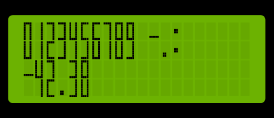  |  |  |
| 2x2 | 1 |   |  | 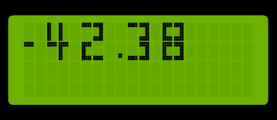 |
| 3x2 | 1 |   |  | 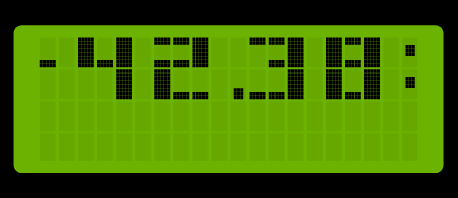 |
| 3x2 | 2 |   |  | 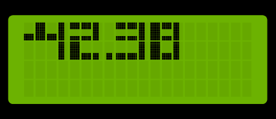 |
| 3x2 | 3 | 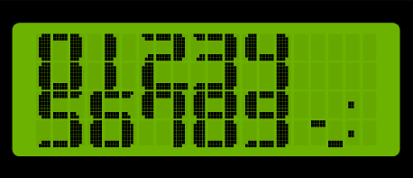  |  | 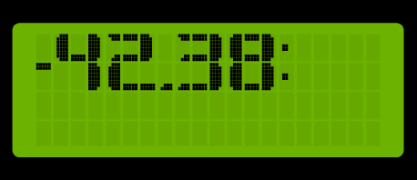 |
| 2x3 | 1 |  |  | 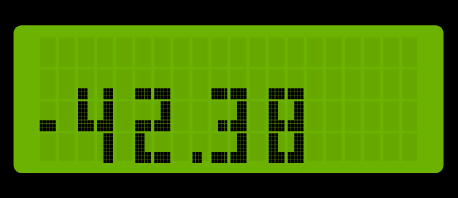 |
| 2x3 | 2 |  |  | 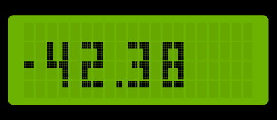 |
| 3x3 | 1 |  |  | 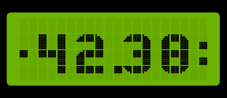 |
| 3x4 | 1 |  |  | 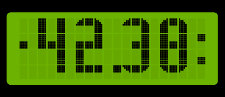 |
| 3x4 | 2 |  |  | 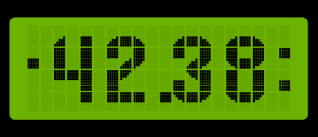 |

<br/>

# Compile options / macros for this library
To customize the library to different requirements, there are some compile options / macros available.<br/>
These macros must be defined in your program **before** the line `#include <LCDBigNumbers.hpp>` to take effect.<br/>
Modify them by enabling / disabling them, or change the values if applicable.

| Name | Default value | Description |
|-|-:|-|
| `USE_PARALLEL_2004_LCD` `USE_PARALLEL_1602_LCD` | USE_PARALLEL_2004_LCD is default | Use parallel 6 or 10 wire LCD connection with the [Arduino LiquidCrystal library](http://www.arduino.cc/en/Reference/LiquidCrystal). |
| `USE_SERIAL_2004_LCD` `USE_SERIAL_1602_LCD` | not defined | Use serial 4 wire LCD connection provided by the [LiquidCrystal_I2C library](https://github.com/marcoschwartz/LiquidCrystal_I2C). |

# Why *.hpp instead of *.cpp?
**Every \*.cpp file is compiled separately** by a call of the compiler exclusively for this cpp file. These calls are managed by the IDE / make system.
In the Arduino IDE the calls are executed when you click on *Verify* or *Upload*.<br/>
And now our problem with Arduino is: **How to set [compile options](#compile-options--macros-for-this-library) for all *.cpp files, especially for libraries used?**<br/>
IDE's like [Sloeber](https://github.com/ArminJo/ServoEasing#modifying-compile-options--macros-with-sloeber-ide) or [PlatformIO](https://github.com/ArminJo/ServoEasing#modifying-compile-options--macros-with-platformio) support this by allowing to specify a set of options per project.
They add these options at each compiler call e.g. `-DTRACE`.<br/>
But Arduino lacks this feature. So the **workaround** is not to compile all sources separately, but to concatenate them to one huge source file by including them in your source.
This is done by e.g. `#include "LCDBigNumbers.hpp"`.
<br/>
But why not `#include "LCDBigNumbers.cpp"`?<br/>
Try it and you will see tons of errors, because each function of the *.cpp file is now compiled twice,
first by compiling the huge file and second by compiling the *.cpp file separately, like described above.
So using the extension *cpp* is not longer possible, and one solution is to use *hpp* as extension, to show that it is an included *.cpp file.
Every other extension e.g. *cinclude* would do, but *hpp* seems to be common sense.

<br/>

# Revision History
### Version 1.2.2
- Improved _createChar().
- Added `VERSION_LCD_BIG_NUMBERS`.

### Version 1.2.1
- Fixed bug of not working forceGapBetweenNumbers for BIG_NUMBERS_FONT_1_COLUMN_2_ROWS_VARIANT_1.

### Version 1.2.0
- Support for floating point numbers.

### Version 1.1.1
- Removed compiler warning.

### Version 1.1.0
- Changed handling of space and therefore introduced `ONE_COLUMN_SPACE_STRING` and `ONE_COLUMN_SPACE_CHARACTER`.
### Version 1.0.0
 Initial Arduino library version.
